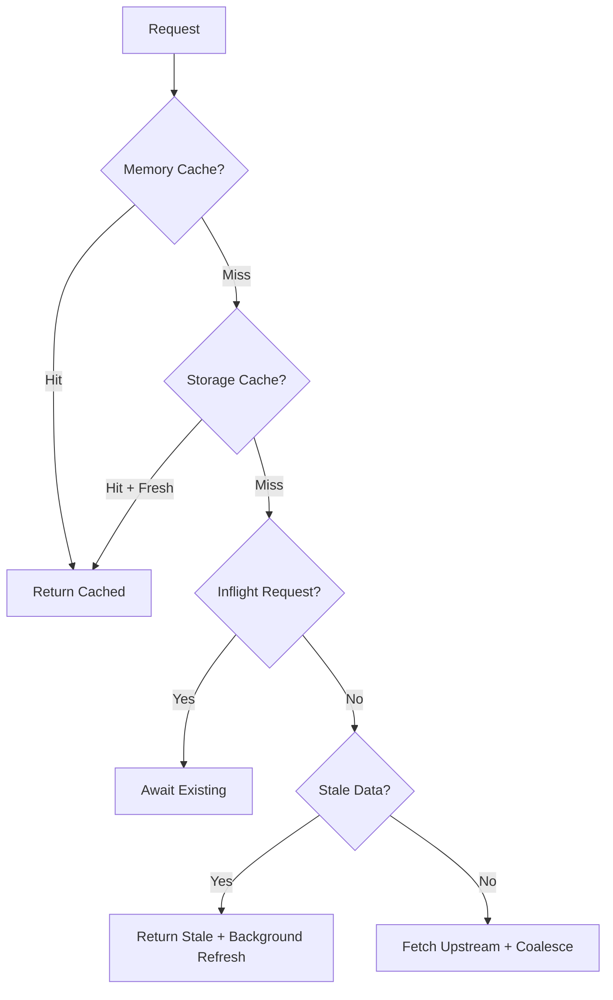

# Durable Objects

## ProductCoalescer

A Durable Object that implements request coalescing and multi-tier caching for product API calls.

### Architecture

```
Request → Worker → Named DO Instance
                         |
                   [Multi-Tier Cache]
                         ↓
                   Memory Cache (fastest)
                         ↓
                   Storage Cache (persistent)
                         ↓
                   Upstream API (slowest)
```

### Key Features

1. **Request Coalescing**: Multiple concurrent identical requests are deduplicated into a single upstream call
   - Prevents thundering herd problem
   - Named DOs ensure same product+fields → same instance globally

2. **Multi-Tier Caching**:
   - **Memory**: Sub-millisecond access, lost on hibernation
   - **Storage**: Persistent across hibernations, per-DO instance
   - **Upstream**: Fallback to actual API

3. **Stale-While-Revalidate**: Returns stale data immediately while refreshing in background
   - `FRESH_TTL_MS`: How long data is considered fresh (default: 10s)
   - `STALE_TTL_MS`: How long stale data can still be served (default: 60s)

### Request Flow



### Configuration

Environment variables:

- `FRESH_TTL_MS`: Time data is fresh (default: 10000ms)
- `STALE_TTL_MS`: Time stale data can be served (default: 60000ms)
- `PRODUCT_API_BASE`: Upstream API base URL
