# Durable Objects

## RequestCoalescer

A **generic** Durable Object that implements request coalescing and multi-tier caching for any type of API call.

### Architecture

```
Request → Worker → Named DO Instance
                         |
                   [Multi-Tier Cache]
                         |
                   Memory Cache (fastest)
                         ↓
                   Storage Cache (persistent)
                         ↓
                   Upstream API (slowest)
```

### Key Features

1. **Generic & Configurable**: Works with any API by providing:
   - Custom cache key builder (determines request uniqueness)
   - Custom upstream URL builder (constructs API calls)
   - Named DO routing strategy (assigns requests to DO instances)

2. **Request Coalescing**: Multiple concurrent identical requests are deduplicated into a single upstream call
   - Prevents thundering herd problem
   - Named DOs ensure same cache key → same instance globally
   - All waiting requests receive the same response

3. **Multi-Tier Caching**:
   - **Memory**: Sub-millisecond access, lost on hibernation
   - **Storage**: Persistent across hibernations, per-DO instance
   - **Upstream**: Fallback to actual API

4. **Stale-While-Revalidate**: Returns stale data immediately while refreshing in background
   - `FRESH_TTL_MS`: How long data is considered fresh (default: 10s)
   - `STALE_TTL_MS`: How long stale data can still be served (default: 60s)

### Request Flow

```mermaid
graph TD
    A[Request] --> B{Memory Cache?}
    B -->|Hit| C[Return Cached]
    B -->|Miss| D{Storage Cache?}
    D -->|Hit + Fresh| C
    D -->|Miss| E{Inflight Request?}
    E -->|Yes| F[Await Existing]
    E -->|No| G{Stale Data?}
    G -->|Yes| H[Return Stale + Background Refresh]
    G -->|No| I[Fetch Upstream + Coalesce]
```



### Configuration

The `RequestCoalescer` is configured through the `CoalescerConfig` interface:

```typescript
interface CoalescerConfig {
  // Builds cache key from request params
  buildCacheKey: (params: Record<string, any>) => CoalescedKey;

  // Builds upstream URL from params and API base
  buildUpstreamUrl: (params: Record<string, any>, apiBase: string) => string;
}
```

**Example: Products by ID and Fields**

```typescript
{
  buildCacheKey: (params) => {
    const fields = Array.from(new Set(params.fields)).sort();
    return `${params.productId}::${fields.join(",")}`;
  },
  buildUpstreamUrl: (params, apiBase) => {
    const url = new URL(`${apiBase}/product`);
    url.searchParams.set("productId", params.productId);
    if (params.fields.length) url.searchParams.set("fields", params.fields.join(","));
    return url.toString();
  }
}
```

**Example: Users by ID Only**

```typescript
{
  buildCacheKey: (params) => params.userId,
  buildUpstreamUrl: (params, apiBase) =>
    `${apiBase}/user?userId=${params.userId}`
}
```

Environment variables (configured in `wrangler.jsonc`):

- `FRESH_TTL_MS`: Time data is fresh (default: 10000ms / 10s)
- `STALE_TTL_MS`: Time stale data can be served (default: 60000ms / 60s)
- API base URLs: `PRODUCT_API_BASE`, `USER_API_BASE`, etc.

### Usage

The `RequestCoalescer` is used via the `createCoalescedHandler` factory in route handlers:

```typescript
// Create a coalesced handler for any resource
export const getProducts = createCoalescedHandler<ProductParams>({
  doBindingName: "REQUEST_COALESCER",
  apiBaseEnvVar: "PRODUCT_API_BASE",
  parseRequest: (request) => { /* parse params */ },
  buildDOName: (params) => params.productId,
  coalescerConfig: {
    buildCacheKey: (params) => /* cache key */,
    buildUpstreamUrl: (params, apiBase) => /* URL */
  }
});
```

See the [products route handler](../routes/products.ts) for a complete example.
